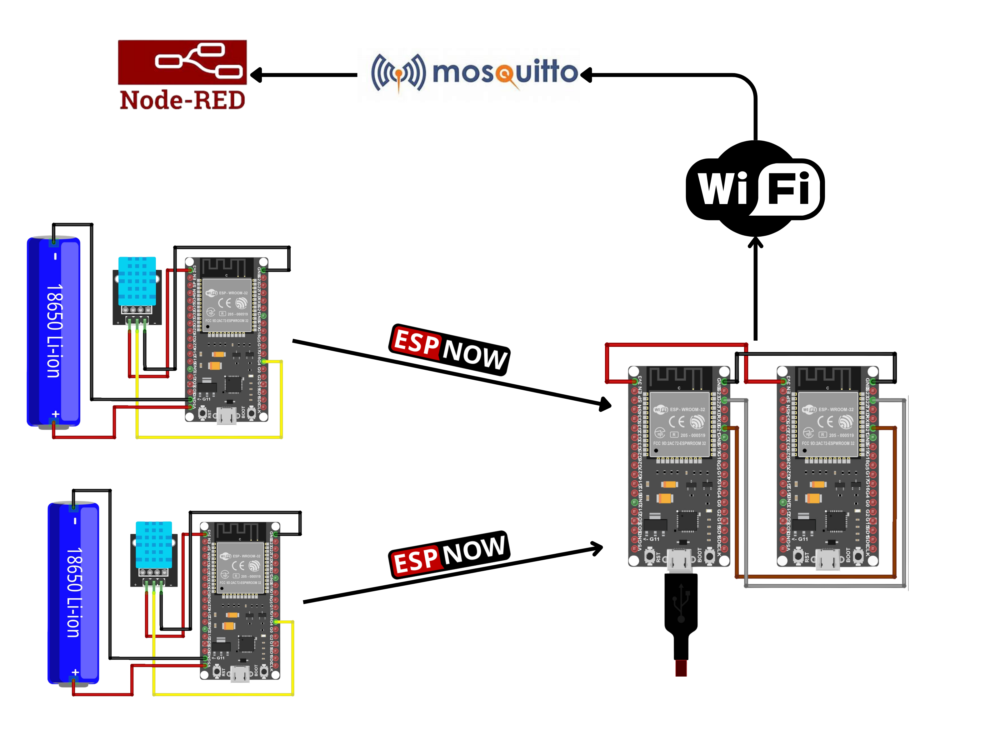

# Building an Energy-Efficient Wireless Sensor Network Using ESP32, ESP-NOW, and MQTT

In this project, we will create a robust and energy-efficient **wireless sensor network** using **ESP32** boards. Sensor data will be collected from **DHT11 temperature and humidity sensors** and transmitted using **ESP-NOW**, a low-power communication protocol. The data will then be forwarded to an MQTT broker via a bridge ESP32 connected over I2C, solving the challenge of Wi-Fi interruptions while using ESP-NOW.

This project is ideal for scenarios like remote environmental monitoring or smart agriculture, where efficient data transmission and power conservation are critical.

---

## Features
1. **Energy Efficiency:** Sender nodes use light sleep mode to conserve power.
2. **Robust Wireless Communication:** ESP-NOW ensures low-latency, Wi-Fi-independent communication.
3. **Scalable Data Management:** Data is forwarded to an MQTT broker for remote monitoring and integration with IoT platforms.
4. **Battery Life Optimization:** Includes calculations to estimate battery runtime for sender nodes powered by a 3.7V 1500mAh battery.

---

## System Architecture

### System Diagram


---

### Components
1. **Sender Nodes (2 ESP32s):**
   - Read data from DHT11 sensors.
   - Transmit data to the receiver via ESP-NOW.
   - Enter light sleep mode between transmissions for energy efficiency.

2. **Receiver Node (1 ESP32):**
   - Collects data from both sender nodes using ESP-NOW.
   - Forwards the data to the bridge node over I2C communication.

3. **Bridge Node (1 ESP32):**
   - Receives data from the receiver node via I2C.
   - Publishes the data to an MQTT broker for IoT integration.

---

## Step 1: Hardware Setup

### Materials Required
- 4x **ESP32 boards**
- 2x **DHT11 Sensors**
- Jumper Wires
- Breadboard
- Power supply or batteries for sender nodes

### Wiring Diagrams

#### Sender Node:
| Component | ESP32 Pin |
|-----------|-----------|
| VCC       | 3.3V      |
| GND       | GND       |
| Data      | GPIO4     |

#### Receiver Node and Bridge Node:
- Receiver and Bridge are connected via I2C:
  - **SDA (Receiver):** GPIO21 -> **SDA (Bridge):** GPIO21
  - **SCL (Receiver):** GPIO22 -> **SCL (Bridge):** GPIO22

---

## Step 2: Configuring Sender Nodes

The sender nodes will:
1. Read temperature and humidity from the DHT11 sensor.
2. Send the data via ESP-NOW to the receiver ESP32.
3. Enter light sleep mode to save energy.

### Sender Node Code

```cpp
#include <esp_now.h>
#include <WiFi.h>
#include <DHT.h>

#define DHTPIN 4
#define DHTTYPE DHT11

DHT dht(DHTPIN, DHTTYPE);

// Structure to hold data
typedef struct struct_message {
  float temperature;
  float humidity;
} struct_message;

struct_message sensorData;

uint8_t receiverAddress[] = {0x24, 0x6F, 0x28, 0xAB, 0xCD, 0xEF}; // Replace with receiver MAC

void setup() {
  Serial.begin(115200);
  WiFi.mode(WIFI_STA);
  dht.begin();

  // Initialize ESP-NOW
  if (esp_now_init() != ESP_OK) {
    Serial.println("Error initializing ESP-NOW");
    return;
  }

  // Register peer
  esp_now_peer_info_t peerInfo;
  memcpy(peerInfo.peer_addr, receiverAddress, 6);
  peerInfo.channel = 0;
  peerInfo.encrypt = false;

  if (esp_now_add_peer(&peerInfo) != ESP_OK) {
    Serial.println("Failed to add peer");
    return;
  }
}

void loop() {
  // Read sensor data
  sensorData.temperature = dht.readTemperature();
  sensorData.humidity = dht.readHumidity();

  if (isnan(sensorData.temperature) || isnan(sensorData.humidity)) {
    Serial.println("Failed to read from DHT sensor!");
    return;
  }

  // Send data via ESP-NOW
  esp_now_send(receiverAddress, (uint8_t *)&sensorData, sizeof(sensorData));
  Serial.println("Data sent!");

  // Enter light sleep mode
  esp_sleep_enable_timer_wakeup(10 * 1000000); // 10 seconds
  esp_light_sleep_start();
}
```
## Step 3: Configuring the Receiver Node
# The receiver node will:

1. Receive data from both sender nodes via ESP-NOW.
2. Forward the data to the bridge node over I2C.
3. Receiver Node Code

```cpp
#include <esp_now.h>
#include <WiFi.h>
#include <Wire.h>

// Structure to hold received data
typedef struct struct_message {
  float temperature;
  float humidity;
} struct_message;

struct_message receivedData;

// Callback when data is received
void onDataRecv(const uint8_t *mac, const uint8_t *incomingData, int len) {
  memcpy(&receivedData, incomingData, sizeof(receivedData));
  Wire.beginTransmission(8); // I2C address of bridge node
  Wire.write((uint8_t *)&receivedData, sizeof(receivedData));
  Wire.endTransmission();
  Serial.printf("Data received: Temp: %.2f, Humidity: %.2f\n", receivedData.temperature, receivedData.humidity);
}

void setup() {
  Serial.begin(115200);
  WiFi.mode(WIFI_STA);
  Wire.begin(21, 22); // I2C pins SDA=21, SCL=22

  // Initialize ESP-NOW
  if (esp_now_init() != ESP_OK) {
    Serial.println("Error initializing ESP-NOW");
    return;
  }

  esp_now_register_recv_cb(onDataRecv);
}

void loop() {
  delay(1000); // Keep running
}
```
## Step 4: Setting Up the MQTT Bridge

### The bridge node will:

1. Receive sensor data from the receiver node via I2C.
2. Publish the data to the MQTT broker.

### Bridge Node Code

```cpp
#include <Wire.h>
#include <WiFi.h>
#include <PubSubClient.h>

const char *ssid = "YourSSID";
const char *password = "YourPassword";
const char *mqtt_server = "YourMQTTBrokerIP";

WiFiClient espClient;
PubSubClient client(espClient);

typedef struct struct_message {
  float temperature;
  float humidity;
} struct_message;

struct_message receivedData;

void setup_wifi() {
  delay(10);
  WiFi.begin(ssid, password);
  while (WiFi.status() != WL_CONNECTED) {
    delay(500);
    Serial.print(".");
  }
  Serial.println("WiFi connected");
}

void setup() {
  Serial.begin(115200);
  setup_wifi();
  client.setServer(mqtt_server, 1883);
  Wire.begin(21, 22); // I2C pins SDA=21, SCL=22
}

void loop() {
  Wire.requestFrom(8, sizeof(receivedData)); // I2C address of receiver node
  if (Wire.available()) {
    Wire.readBytes((char *)&receivedData, sizeof(receivedData));
    char tempStr[8], humStr[8];
    dtostrf(receivedData.temperature, 1, 2, tempStr);
    dtostrf(receivedData.humidity, 1, 2, humStr);

    if (!client.connected()) {
      client.connect("ESP32Bridge");
    }

    client.publish("sensors/temperature", tempStr);
    client.publish("sensors/humidity", humStr);
    Serial.printf("Published: Temp: %s, Humidity: %s\n", tempStr, humStr);
  }

  client.loop();
  delay(2000);
}
```
# Duty Cycle Calculation

The steps to calculate the **Duty Cycle** based on the data provided from the sender and receiver logs.

---

## 1. Definitions

- **Active Time per Cycle (`T_active`)**: 
  - The time the sender is actively transmitting data.
  - From the logs, this is approximately **17 ms** per transmission.

- **Cycle Period (`T_cycle`)**: 
  - The time interval between consecutive transmissions.

## 2. Data Analysis

From the sender timestamps:
- `5194 - 168 = 5026 ms`
- `10219 - 5194 = 5025 ms`
- `15244 - 10219 = 5025 ms`
- `20269 - 15244 = 5025 ms`
- `25294 - 20269 = 5025 ms`

### Average Cycle Period:

T_cycle ≈ 5025 ms = 5.025 seconds

## 3. Formula

The Duty Cycle is calculated using the formula:
  Duty Cycle = (T_active / T_cycle) × 100

---

## 4. Calculation

### Step 1: Calculate Active Time (`T_active`):
From the receiver logs, the time taken per transmission is:
  T_active = 17 ms = 0.017 seconds

### Step 2: Calculate Duty Cycle:
Substitute the values into the formula:
  Duty Cycle = (0.017 / 5.025) × 100

Perform the division:
  0.017 / 5.025 ≈ 0.003384

Multiply by 100:
  Duty Cycle ≈ 0.34%
---

## Final Answer:

The duty cycle for this sender is approximately:
0.34%

Low Duty Cycle means that the device is spending most of its time in sleep mode, and only a small portion of the time is spent transmitting data. This results in lower power consumption and extended battery life, which is particularly important for battery-operated devices like the one you're building.

In our case, only 0.34% of the time is spent transmitting data, while the rest (99.66%) is spent in light sleep mode, conserving energy.

## 2. Average Current Consumption

Key power consumption values for ESP-NOW communication:


the above image was refered in this website [deepblueembedded](https://deepbluembedded.com/esp32-sleep-modes-power-consumption/#:~:text=ESP32%20Active%20mode%20current%20consumption%20is%3A%20%2895~240%29%20mA%2C,clock%20speed%20at%20which%20you%E2%80%99re%20operating%20the%20microcontroller.)


### Average Current Formula

```
Iavg = (Itransmission × Duty Cycle) + (Isleep × (1 - Duty Cycle))
```

Calculation:
```
Iavg = (180 × 0.0034) + (0.02 × 0.9966)
Iavg = 0.612 mA + 0.02 mA = 0.632 mA
```

**Result**: The average current consumption is approximately **0.632 mA**

## 3. Battery Life Estimation

Using a 1500mAh 3.7V 18650 battery:

### Battery Life Formula

```
Battery Life = Battery Capacity / Iavg
```

Calculation:
```
Battery Life = 1500 mAh / 0.632 mA ≈ 2373 hours
Battery Life ≈ 2373 hours ≈ 99 days
```

**Result**: The estimated battery life is approximately **99 days**

## 4. Conclusions

### Key Findings
- Battery Specifications: 1500mAh 3.7V 18650
- Average Current Draw: 0.632 mA
- Estimated Battery Life: 99 days (under ideal conditions)

### Factors Affecting Real-World Performance
- Signal strength variations
- Battery health and degradation
- Operating temperature
- Environmental interference
- Device wake-up time overhead

## Conclusion

Based on the calculations, with an average current consumption of approximately 0.615mA, your 1500mAh 3.7V 18650 battery would last around 101.6 days under ideal conditions with very minimal current draw during sleep and the small duty cycle of active transmission.

This estimation assumes that the device sleeps most of the time and only occasionally transmits data for a very short period (17ms). The actual battery life might vary based on environmental factors such as Wi-Fi signal strength, transmission power settings, and temperature.

